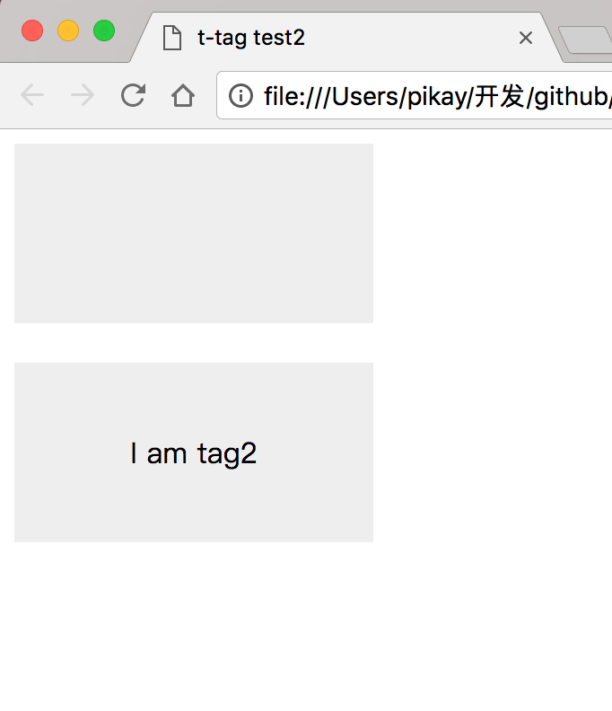

## shear模板

话不多说，直接开干

```html
<!DOCTYPE html>
<html lang="en">

<head>
    <meta charset="UTF-8">
    <meta name="viewport" content="width=device-width, initial-scale=1.0">
    <meta http-equiv="X-UA-Compatible" content="ie=edge">
    <title>t-tag test</title>
    <script src="../src/shear.js"></script>
    <style>
        t-tag,
        [sv-register="t-tag"] {
            display: block;
        }
        
        t-tag .t-tag-inner,
        [sv-register="t-tag"] .t-tag-inner {
            width: 200px;
            height: 100px;
            text-align: center;
            line-height: 100px;
            background-color: #eee;
        }
    </style>
</head>

<body>
    <div id="a" sv-register="t-tag">
        <div class="t-tag-inner">I am t-tag</div>
    </div>

    <br>

    <t-tag sv-ele></t-tag>
    <t-tag></t-tag>
</body>
<script>
    shear.register({
        ele: $('#a')
    });
</script>

</html>
```

我们看看预览的页面是怎样的？


id为 `a` 的元素正常的渲染出来，但为什么下面会多一个同样的元素？

通过 `shear.register` 方法注册 `#a` 元素，而 `#a` 的 `sv-register` 属性值是 `t-tag`，所以注册了一个名为 `t-tag`的元素；

只要出现为 `t-tag` 的元素，就会被自动填充注册元素的内容（案例中是填充 `t-tag-inner`，所以写样式的时候也要加上）；

说白了，真实的html会变成以下的样子；

```html
<body>
    <div id="a" sv-register="t-tag">
        <div class="t-tag-inner">I am t-tag</div>
    </div>

    <br>

    <t-tag sv-render="1">
        <div class="t-tag-inner">I am t-tag</div>
    </t-tag>
    <t-tag></t-tag>
</body>
```

被渲染后的 `sv-ele` 元素，会被去掉改属性，替换为 `sv-render` 属性并设置值为 1;


但是，html中有两个 `t-tag`，为什么只渲染了一个？

因为，带有 `sv-ele` 属性的元素才会被渲染，而没带 `sv-ele` 的元素不会被处理。

为了少写css的选择器，一般直接使用自定义元素来注册，如下；

```html
<!DOCTYPE html>
<html lang="en">

<head>
    <meta charset="UTF-8">
    <meta name="viewport" content="width=device-width, initial-scale=1.0">
    <meta http-equiv="X-UA-Compatible" content="ie=edge">
    <title>t-tag test</title>
    <script src="../src/shear.js"></script>
    <style>
        t-tag {
            display: block;
        }
        
        t-tag .t-tag-inner{
            width: 200px;
            height: 100px;
            text-align: center;
            line-height: 100px;
            background-color: #eee;
        }
    </style>
</head>

<body>
    <t-tag id="a" sv-register="t-tag">
        <div class="t-tag-inner">I am t-tag</div>
    </t-tag>

    <br>

    <t-tag sv-ele></t-tag>
    <t-tag></t-tag>
</body>
<script>
    shear.register({
        ele: $('#a')
    });
</script>

</html>
```

因为注册元素自身并不带有 `sv-ele` 属性，所以自身并不会被渲染，能够走通注册的流程；

### 模板容器

模板也是具有容器的，上面案例中的模板没有容器；下面我们再写个带有容器的模板；

```html
<!DOCTYPE html>
<html lang="en">

<head>
    <meta charset="UTF-8">
    <meta name="viewport" content="width=device-width, initial-scale=1.0">
    <meta http-equiv="X-UA-Compatible" content="ie=edge">
    <title>t-tag test2</title>
    <script src="../src/shear.js"></script>
    <style>
        t-tag {
            display: block;
        }
        
        t-tag .t-tag-inner {
            width: 200px;
            height: 100px;
            text-align: center;
            line-height: 100px;
            background-color: #eee;
        }
    </style>
</head>

<body>
    <t-tag id="a" sv-register="t-tag">
        <div class="t-tag-inner" sv-content></div>
    </t-tag>

    <br>

    <t-tag id="b" sv-ele>I am tag2</t-tag>
</body>
<script>
    shear.register({
        ele: $('#a')
    });
</script>

</html>
```

预览效果如下图；



和之前案例的区别，在之前的 `#a` 元素里的子元素 `.t-tag-inner`，加了一个属性 `sv-content`；

所以，在后面的自定义元素里的内容，会被放到渲染元素后的带有 `sv-content` 的元素里；

所以，真实的html会变成下面的样子；

```html
<body>
    <t-tag id="a" sv-register="t-tag">
        <div class="t-tag-inner" sv-content></div>
    </t-tag>

    <br>

    <t-tag id="b" sv-render="1">
        <div class="t-tag-inner" sv-content>I am tag2</div>
    </t-tag>
</body>
```