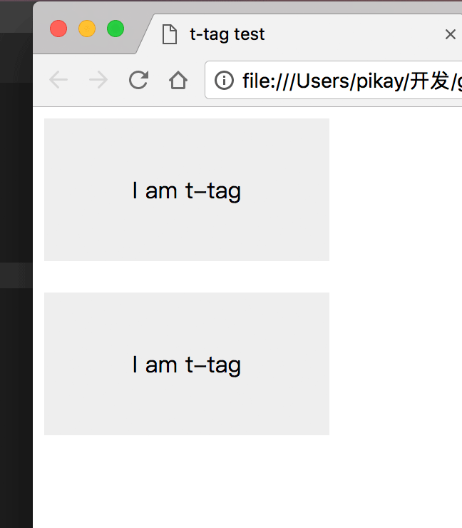

## shear模板

话不多说，直接开干

```html
<!DOCTYPE html>
<html lang="en">

<head>
    <meta charset="UTF-8">
    <meta name="viewport" content="width=device-width, initial-scale=1.0">
    <meta http-equiv="X-UA-Compatible" content="ie=edge">
    <title>t-tag test</title>
    <script src="../src/shear.js"></script>
    <style>
        t-tag,
        [sv-register="t-tag"] {
            display: block;
        }
        
        t-tag .t-tag-inner,
        [sv-register="t-tag"] .t-tag-inner {
            width: 200px;
            height: 100px;
            text-align: center;
            line-height: 100px;
            background-color: #eee;
        }
    </style>
</head>

<body>
    <div id="a" sv-register="t-tag">
        <div class="t-tag-inner">I am t-tag</div>
    </div>

    <br>

    <t-tag sv-ele></t-tag>
</body>
<script>
    shear.register({
        ele: $('#a')
    });
</script>

</html>
```

我们看看预览的页面是怎样的？

