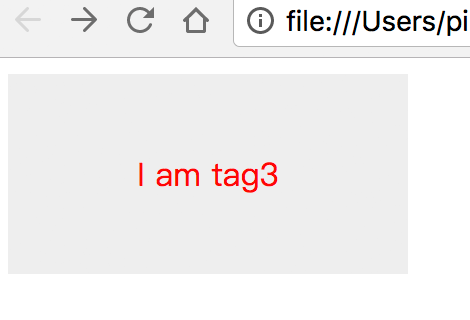
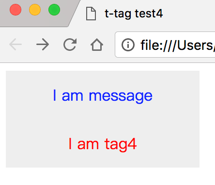
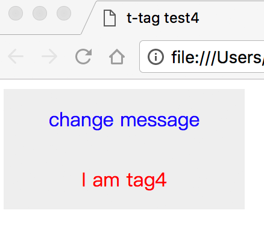
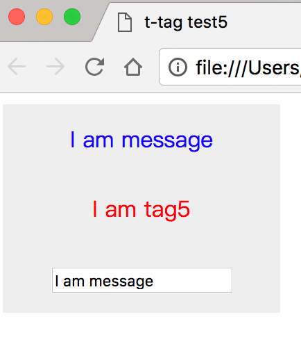
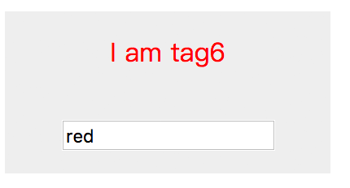
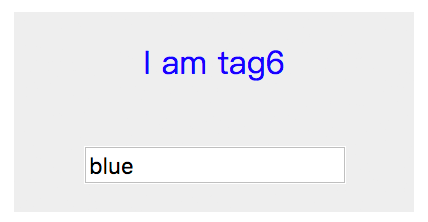
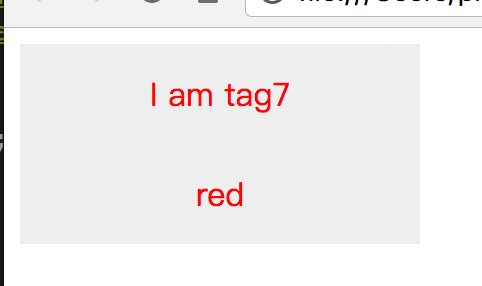
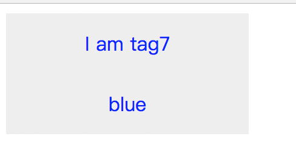
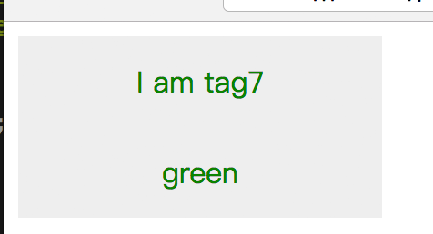

## 数据绑定

### 前言

`shear.js` 内部已经封装好了jQuery API，完全当成 jQuery 使用就行；

后续我们将 shear.js 封装的组件称为 `shear组件`，shear.js 定义的元素称为 `shear元素`；

### render callback

当 shear元素 渲染完成后，会执行 render callback

```html
<script>
shear.register({
    template: `
        <div sv-register="t-tag">
            <div class="t-tag-inner" sv-content></div>
        </div>
    `,
    render:function($ele){
        $ele.css("color","red");
    }
});
</script>
<body>
    <t-tag id="b" sv-ele>I am tag3</t-tag>
</body>
```

预览图是这样的：



当 `#b` 内部的html填充完成后，会执行定义在register上的render函数，而第一个参数就是被渲染的元素；

所以上面案例执行render函数后的 html 如下：

```html
<t-tag id="b" sv-render="1" style="color: red;">
    <div class="t-tag-inner" sv-content>I am tag3</div>
</t-tag>
```

### 声明式渲染

参考了众多 MVVM 的框架，`shear组件` 也能使用声明式渲染的语法，但要在注册模板中使用；

```javascript
// t-tag.js
shear.register({
    template: `
        <div sv-register="t-tag">
            <div class="t-tag-inner">
                <div style="color:blue">{{message}}</div>
                <div sv-content></div>
            </div>
        </div>
    `,
    data: {
        message: "I am message"
    },
    render: function($ele) {
        $ele.css("color", "red");
    }
});
```

```html
<!DOCTYPE html>
<html lang="en">

<head>
    <meta charset="UTF-8">
    <meta name="viewport" content="width=device-width, initial-scale=1.0">
    <meta http-equiv="X-UA-Compatible" content="ie=edge">
    <title>t-tag test4</title>
    <script src="shear.js"></script>
    <script src="t-tag.js"></script>
    <style>
        t-tag {
            display: block;
        }
        
        t-tag .t-tag-inner {
            width: 200px;
            height: 100px;
            text-align: center;
            line-height: 50px;
            background-color: #eee;
        }
    </style>
</head>

<body>
    <t-tag id="a" sv-ele>I am tag4</t-tag>
</body>

</html>
```

预览图效果如下：



这时候，我们通过 `$` 获取元素可以得到 shear实例化对象；

```javascript
var m = $('#a').message;
console.log(m); // => I am message;
```

如果我们修改message的值，声明式渲染的文本也会动态响应。

```javascript
$('#a').message = "change message";
```



### 输入绑定

使用 `sv-module` 指令，可实现表单输入和元素数据之间的双向绑定；

```html
<!DOCTYPE html>
<html lang="en">

<head>
    <meta charset="UTF-8">
    <meta name="viewport" content="width=device-width, initial-scale=1.0">
    <meta http-equiv="X-UA-Compatible" content="ie=edge">
    <title>t-tag test5</title>
    <script src="shear.js"></script>
    <style>
        t-tag {
            display: block;
        }
        
        t-tag .t-tag-inner {
            width: 200px;
            text-align: center;
            line-height: 50px;
            background-color: #eee;
        }
    </style>
    <script>
        shear.register({
            template: `
                <div sv-register="t-tag">
                    <div class="t-tag-inner">
                        <div style="color:blue">{{message}}</div>
                        <div sv-content></div>
                        <input type="text" sv-module="message" />
                    </div>
                </div>
            `,
            render: function($ele) {
                $ele.css("color", "red");
            },
            data: {
                message: "I am message"
            }
        });
    </script>
</head>

<body>
    <t-tag id="a" sv-ele>I am tag5</t-tag>
</body>

</html>
```

预览图如下



当修改input的时候，声明式渲染的文本也会动态改变，因为都是绑定 data `message`；

### 属性绑定

#### attrs 属性绑定

在 `attrs` 数组内的属性会被直接设定元素属性；

```html
<style>
    t-tag {
        display: block;
    }
    
    t-tag .t-tag-inner {
        width: 200px;
        text-align: center;
        line-height: 50px;
        background-color: #eee;
    }
    
    t-tag[fcolor="green"] {
        color: green;
    }
    
    t-tag[fcolor="red"] {
        color: red;
    }

    t-tag[fcolor="blue"] {
        color: blue;
    }
</style>

<script>
    shear.register({
        template: `
            <div sv-register="t-tag">
                <div class="t-tag-inner">
                    <div sv-content></div>
                    <input type="text" sv-module="fcolor" />
                </div>
            </div>
        `,
        attrs: ['fcolor'],
        data: {
            fcolor: "red"
        }
    });
</script>

<body>
    <t-tag id="a" sv-ele>I am tag6</t-tag>
</body>
```

预览效果如图



被渲染的 t-tag的真实html会如下

```html
<t-tag id="a" sv-render="1" fcolor="red">
    <div class="t-tag-inner">
        <div sv-content>I am tag6</div>
        <input type="text" sv-module="fcolor" />
    </div>
</t-tag>
```

因为在样式上设定 `t-tag[fcolor="red"]` ，所以当前的字体是红色的；

如果将输入框内的文字改成green，那么`#a`元素的属性`fcolor`也会被改成green，根据 `t-tag[fcolor="green"]`，文字会变成绿色；

还是上面的案例，但是改变了 shear元素 的属性 如下：

```html
<style>
    t-tag {
        display: block;
    }
    
    t-tag .t-tag-inner {
        width: 200px;
        text-align: center;
        line-height: 50px;
        background-color: #eee;
    }
    
    t-tag[fcolor="green"] {
        color: green;
    }
    
    t-tag[fcolor="red"] {
        color: red;
    }

    t-tag[fcolor="blue"] {
        color: blue;
    }
</style>

<script>
    shear.register({
        template: `
            <div sv-register="t-tag">
                <div class="t-tag-inner">
                    <div sv-content></div>
                    <input type="text" sv-module="fcolor" />
                </div>
            </div>
        `,
        attrs: ['fcolor'],
        data: {
            fcolor: "red"
        }
    });
</script>

<body>
    <t-tag id="a" fcolor="blue" sv-ele>I am tag6</t-tag>
</body>
```



虽然自定义数据(`fcolor: "red"`)的值是red，但是已经在shear元素上设置了该属性 `<t-tag id="a" fcolor="blue" sv-ele>`，会优先使用 shear元素 上的值，数值的变动也会动态；

#### props 属性绑定

和attrs属性绑定类似，但 props 内的属性只会设置一次数据，并且不会动态绑定属性值；

```html
<script>
    shear.register({
        template: `
            <div sv-register="t-tag">
                <div class="t-tag-inner">
                    <div sv-content></div>
                    <input type="text" sv-module="fcolor" />
                </div>
            </div>
        `,
        attrs: ['fcolor'],
        data: {
            fcolor: "red"
        }
    });
</script>

<body>
    <t-tag id="a" fcolor="blue" sv-ele>I am tag6</t-tag>
</body>
```

这案例中， `fcolor` 会被设置为blue；但若改变 `fcolor`的值，在元素上的属性不会有变动，`props`上的属性是一次性的，并且是给使用时使用的；

在设置值的优先级别上，`props`>`attrs`>`data`；

### watch Event

```html
<head>
    ...
    <style>
        t-tag {
            display: block;
        }
        
        t-tag .t-tag-inner {
            width: 200px;
            text-align: center;
            line-height: 50px;
            background-color: #eee;
        }
    </style>
    <script>
        shear.register({
            template: `
                <div sv-register="t-tag">
                    <div class="t-tag-inner">
                        <div sv-content></div>
                            {{m}}
                    </div>
                </div>
            `,
            data: {
                m: "red"
            },
            watch: {
                m: function(val, before) {
                    this.css('color', val);
                }
            }
        });
    </script>
</head>

<body>
    <t-tag id="a" sv-ele>I am tag7</t-tag>
</body>

</html>
```



绑定在 watch 对象上的属性，值是对应回调函数；

`this`指向的是渲染后的 shear元素，`arg[0]`是设定的 value 值，`arg[1]`是之前的 value 值；

回调函数会在`render`前执行，而且最开始绑定的值也会运行回调函数，比如上面的案例， 会运行一次`m`的`val`为red的回调函数；

这时，我们修改`m`的值，也会触发`watch`中的`m`的回调函数；

```javascript
$('#a').m = "blue";
```



在加个案例：


```html
<head>
    ...
    <style>
        t-tag {
            display: block;
        }
        
        t-tag .t-tag-inner {
            width: 200px;
            text-align: center;
            line-height: 50px;
            background-color: #eee;
        }
    </style>
    <script>
        shear.register({
            template: `
                <div sv-register="t-tag">
                    <div class="t-tag-inner">
                        <div sv-content></div>
                            {{m}}
                    </div>
                </div>
            `,
            data: {
                m: "red"
            },
            attrs: ['m'],
            watch: {
                m: function(val, before) {
                    this.css('color', val);
                }
            }
        });
    </script>
</head>

<body>
    <t-tag id="a" m="green" sv-ele>I am tag7</t-tag>
</body>

</html>
```



因为 `attrs` 上的值优先于 `data`，所以`m`的`val`为green而不是red；