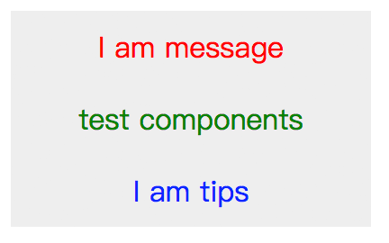
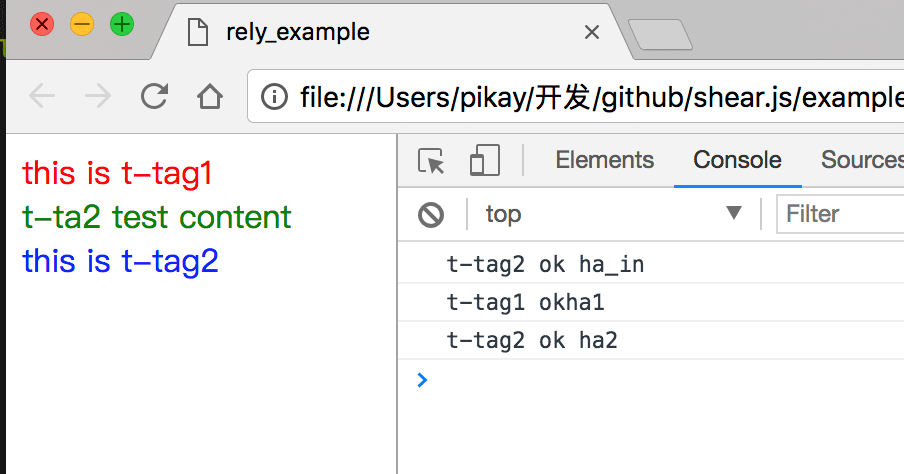
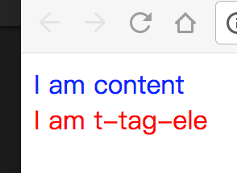
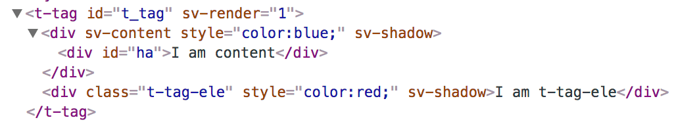
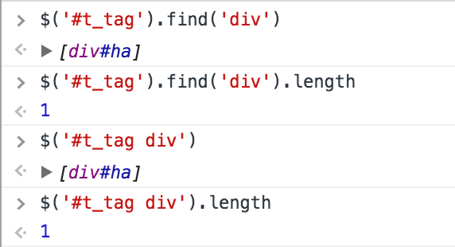

# shearjs的原理和jQuery的不同

### 前言

`shear.js` 内部已经封装好了jQuery API，完全当成 jQuery 使用就行；

后续我们将 shear.js 封装的组件称为 `shear组件`，shear.js 定义的元素称为 `shear元素`；

## shearjs的原理

最主要的部分，shearjs是将html模板化，将定义好的 shear元素 填充为shear模板的内容；

```html
<style>
        t-tag {
            display: block;
        }
        
        t-tag .t-tag-inner {
            width: 200px;
            text-align: center;
            line-height: 50px;
            background-color: #eee;
        }
        
        t-tag [sv-content] {
            color: red;
        }
    </style>
<script>
    shear.register({
        // 注册一个 t-tag shear元素
        template: `
            <div sv-register="t-tag">
                <div class="t-tag-inner">
                    I am t-tag
                    <div sv-content></div>
                </div>
            </div>
        `
    });
</script>
<body>
    <t-tag sv-ele id="tar">ye ye content</t-tag>
</body>
```


shearjs 本质上是参考 web components 而设计的框架，但弥补了 web components 不足（例如元素间的依赖问题和兼容问题），并添加了好用的语法糖（糅合 jQuery API 和 MVVM 的部分好用的特性），并且兼容 web components ；

下面就来一个 web components 和 shearjs 结合的案例；

`test_components.html`

```html
<style>
    t-tag {
        display: block;
    }
    
    t-tag .t-tag-inner {
        width: 200px;
        text-align: center;
        line-height: 40px;
        background-color: #eee;
    }
    
    t-tag [sv-content] {
        color: red;
    }
</style>


<template sv-register="t-tag">
    <div class="t-tag-inner" style="color:red;">
        {{m}}
        <div sv-content style="color:green;"></div>
        <div sv-tar="tips" style="color:blue;">I am tips</div>
    </div>
</template>

<script>
    shear.register({
        template: document.currentScript.ownerDocument.querySelector('[sv-register="t-tag"]').outerHTML,
        render: function($ele) {
            $ele.css("color", "red");
        },
        data: {
            m: "I am message"
        }
    });
</script>
```

`main.html`

```html
<!DOCTYPE html>
<html lang="en">

<head>
    <meta charset="UTF-8">
    <meta name="viewport" content="width=device-width, initial-scale=1.0">
    <meta http-equiv="X-UA-Compatible" content="ie=edge">
    <title>web components 和 shearjs 结合测试</title>
    <script src="shear.js"></script>
    <!-- 引用 test_components -->
    <link rel="import" href="test_components.html">
</head>

<body>
    <t-tag sv-ele> test components </t-tag>
</body>

</html>
```

预览效果



## 关于 shear元素 依赖处理

当 shear元素依赖另一个shear元素时，框架会自动识别依赖的元素，待依赖的元素注册完成后才会开始渲染当前的shear元素；

```html
<style>
    t-tag1,
    t-tag2 {
        display: block;
    }
</style>

<div sv-register="t-tag1" style="display:none;">
    <div sv-content></div>
    <t-tag2 sv-ele data-ha="ha_in">
        t-ta2 test content
    </t-tag2>
</div>

<div sv-register="t-tag2" style="display:none;">
    <div sv-content></div>
</div>

<t-tag1 sv-ele data-ha="ha1">
    this is t-tag1
</t-tag1>

<t-tag2 sv-ele data-ha="ha2">
    <div style="color:blue;">this is t-tag2</div>
</t-tag2>

</body>
<script>
    shear.register({
        name: "t-tag1",
        render: function(tar) {
            tar.css('color', "red");

            console.log('t-tag1 ok' + tar.data('ha'));
        }
    });

    setTimeout(function() {
        shear.register({
            name: "t-tag2",
            render: function(tar) {
                tar.css('color', "green");

                console.log('t-tag2 ok ' + tar.data('ha'));
            }
        });
    }, 1000);
</script>
```

如上外置模板案例，`t-tag1` 内存在 `t-tag2`（可以说成`t-tag1`依赖`t-tag2`），所以当`t-tag2`注册完成后，会先开始渲染 `t-tag1` **内**依赖的 `t-tag2` 元素，继而触发 `t-tag1` 的渲染，最后到外面的 `t-tag2`的渲染；



所以切记，不能依赖里出现死循环（比如 a 依赖 b ， b 依赖 c ， c 又依赖 a 等类似的情况），否则相关的 `shear元素`将会一直处于等待的状态；

## shear影子元素

`shear元素` 在渲染后，会填充模板的元素，这些属于模板的元素称为 `shear影子元素`；

比如：

```html
<t-tag sv-ele id="t_tag">
    <div id="ha">I am content</div>
</t-tag>

<script>
    shear.register({
        template: `
        <div sv-register="t-tag">
            <div sv-content style="color:blue;"></div>
            <div class="t-tag-ele" style="color:red;">I am t-tag-ele</div>
        </div>
        `
    });
</script>
```

渲染后的效果：



渲染后的代码如下：



元素 `.t-tag-ele` 在填充模板后，增加了 `sv-shadow` 属性，这个属于 `shear影子元素`；

而 `#ha` 元素属于 `#t_tag`内原本的元素，不属于 `shear影子元素`；

*（在这案例之前的案例为了增强代码的可读性，没有把 `shear影子元素`的标识 `sv-shadow` 放进去）*

当我们执行下面代码，会发现有什么事？



虽然 `#t-tag` 内含有3个`div`，但影子元素并不会算在元素里，`shear影子元素`只是辅助填充的代码，不会被查找到，所以只会查到原来拥有的元素 `#ha`；

同理，其他的方法同样回避影子元素；比如：

```javascript
$('.t-tag-ele') // => []
```

`.t-tag-ele` 属于影子元素，查找它是不存在的；

再比如：

```javascript
$('#ha').parent(); // => [t-tag#t_tag]
```

`#ha`元素虽然实际父层是 `[sv-content]`元素，但是容器元素也是影子元素，会向上寻找真实的父元素，就是 `#t_tag`；

所以在开发的时候，可以忽略影子元素，直接当成是原来的元素结构体来开发即可；

但如果是影子元素的实例化对象，是有权限得到影子元素的，比如；

```html
<script>
    shear.register({
        template: `
            <div sv-register="t-tag">
                <div class="t-tag-inner">
                    {{m}}
                    <div sv-content style="color:green;"></div>
                    <div sv-tar="tips" style="color:blue;">
                        <span class="s_tips">I am tips</span>
                    </div>
                </div>
            </div>
        `,
        render: function($ele) {
            $ele.css("color", "red");
        },
        data: {
            m: "I am message"
        }
    });
</script>
<body>
    <t-tag id="a" sv-ele>I am t-tag</t-tag>
</body>
```

```javascript
$('#a').$tips.find('span'); // => [span.tips]
```

通过 `sv-tar` 绑定的元素，同样也是影子元素，`.s_tips`也是影子元素，影子元素获取影子元素，是成立的；

*注：shear实例化对象必须是一个影子元素，才有获取到其他影子元素的权限*