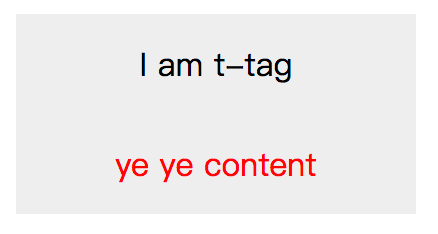

## shearjs的原理和jQuery的不同

### 前言

`shear.js` 内部已经封装好了jQuery API，完全当成 jQuery 使用就行；

后续我们将 shear.js 封装的组件称为 `shear组件`，shear.js 定义的元素称为 `shear元素`；

### shearjs的原理

最主要的部分，shearjs是将html模板化，将定义好的 shear元素 填充为shear模板的内容；

```html
<style>
        t-tag {
            display: block;
        }
        
        t-tag .t-tag-inner {
            width: 200px;
            text-align: center;
            line-height: 50px;
            background-color: #eee;
        }
        
        t-tag [sv-content] {
            color: red;
        }
    </style>
<script>
    shear.register({
        // 注册一个 t-tag shear元素
        template: `
            <div sv-register="t-tag">
                <div class="t-tag-inner">
                    I am t-tag
                    <div sv-content></div>
                </div>
            </div>
        `
    });
</script>
<body>
    <t-tag sv-ele id="tar">ye ye content</t-tag>
</body>
```



shearjs 本质上是参考 web components 而设计的框架，但弥补了 web components 不足（例如元素间的依赖问题和兼容问题），并添加了好用的语法糖（糅合 jQuery API 和 MVVM 的部分好用的特性）；

### 关于 shear元素 依赖处理

